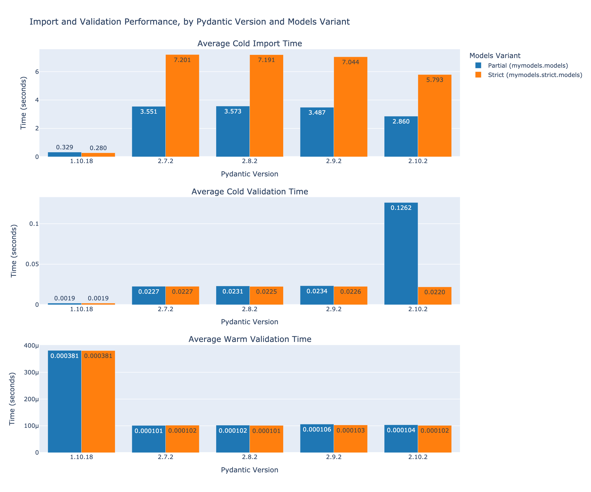

# Pydantic v2 Slower Than v1 on Startup? A Benchmark

This repo aims to serve as a helpful benckmark for the [Pydantic v2 significantly slower than v1](https://github.com/pydantic/pydantic/discussions/6748) issue.
The `mymodels` package contains Pydantic models that are highly interrelated and elicit some of the
performance concerns raised in the GitHub issue. The models and fields have been derived from a set of closed-source
models, with classes and attributes renamed while the preserving structural integrity.


## Benchmark

The following results were produced with the following runtime context:
* system: Darwin
* machine: arm64
* architecture: 64bit
* python_impl: CPython
* python_version: 3.10.15



### Benckmark Details

For each benchmark run, the `bench/run.py` script is executed, which has 3 main steps:
1. Import the models
    - Partial or Strict, depending on which selected via `strict_models` CLI option
2. Validates the data loaded from `tests/data/` directory
    - This involves using a dynamic parsing type validator (i.e. `parse_obj_as` in v1 or `TypeAdapter` in v2)
    - The parsing type is a list of Union type, where Union contains most of the model classes, discriminated via "modelType" field
3. Validates the same data again
    - This time the dynamic type validator / type adapter should be cached, and the operation much faster than first time around
    
The script records the following times (appending to `bench/results.csv` file):
* **Cold Import Time** - The amount of it takes to import the models (step 1)
* **Cold Validation Time** - The amount of time it takes to validate the models before dynamic type validator has been cached
* **Warm Validation Time** - The amount of time it takes to validate the models after dynamic type validator has been cached


### Run the Benchmark

Run benchmark:

```bash
uv run nox -s benchmark
```

## Additional Details

The `mymodels` package defines 4 variant sets of Pydantic models representing the same data model:
1. `mymodels._pydantic_v1.models` - **Pydantic-v1**-compatible models with every field Optional (**Partial** model)
2. `mymodels._pydantic_v1.strict.models` - **Pydantic-v1**-compatible models enforcing required fields (**Strict** model)
1. `mymodels._pydantic_v2.models` - **Pydantic-v2**-compatible models with every field Optional (**Partial** model)
2. `mymodels._pydantic_v2.strict.models` - **Pydantic-v2**-compatible models enforcing required fields (**Strict** model)

For convenience, the package is setup to support pydantic-version-agnotic top-level imports where the appropriate models are
imported transparently based on the installed Pydantic version:

```python
import mymodels.models
import mymodels.strict.models
```

If `pydantic<2.0` is installed, the above would translate to:

```python
import mymodels._pydantic_v1.models
import mymodels._pydantic_v1.strict.models
```

If `pydantic>=2.0` is installed, the above would translate to:

```python
import mymodels._pydantic_v2.models
import mymodels._pydantic_v2.strict.models
```

## Run Tests

Run tests to verify valid models:

```bash
uv run nox -s test
```


